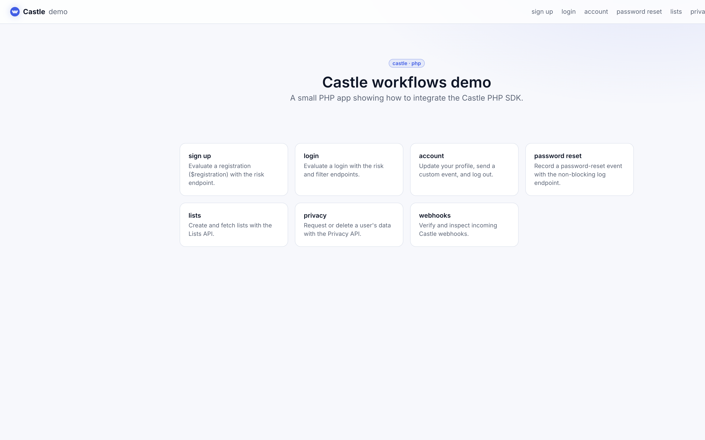
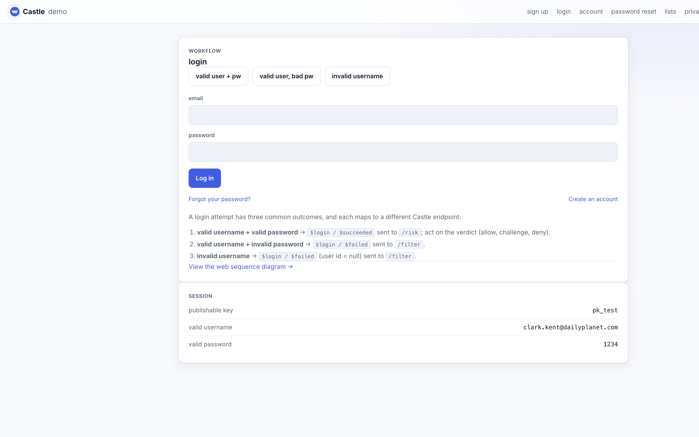

# Castle demo application: PHP

This project demonstrates key Castle workflows in a plain PHP app built on the
[castle/castle-php](https://github.com/castle/castle-php) SDK.

## What's demonstrated

The app walks through a full user lifecycle. Every action mints a fresh Castle
request token in the browser (`Castle.createRequestToken()`) and forwards it to
the backend, which calls Castle and acts on the verdict.

- **sign up** – `$registration` to `filter` (anonymous, so the email goes in `params`): `$attempted` for a new email, `$failed` (resolved via `matching_user_id`) for an email that already exists
- **login** – `$login` reusing one request token across two calls: `filter` `$attempted` first, then `risk` `$succeeded` on success or `filter` `$failed` (wrong password / unknown user)
- **account** – post-login actions: profile update (`$profile_update` to `risk`), a custom event (`Castle.custom()`), and logout (`$logout` via the non-blocking `log` endpoint)
- **password reset** – `$profile_reset` via the non-blocking `log` endpoint
- **lists** – the Lists API (`Castle::createList`, `Castle::getAllLists`)
- **privacy** – the Privacy API (`Castle::requestUserData`, `Castle::deleteUserData`)
- **webhooks** – incoming Castle webhooks are signature-verified with `Castle_Webhook::verify` (against the `X-Castle-Signature` header) and the most recent payloads are listed

## Screenshots

| Home | Login |
| ---- | ----- |
|  |  |

## Prerequisites

You'll need a Castle account. If you don't have one, start a free trial at
https://castle.io. For local development, use a **sandbox** environment so demo
traffic from `localhost` stays separate from production data — from the Castle
dashboard (Settings → API) grab the sandbox keys:

- your **publishable key** (`castle_pk`) – used by the browser SDK
- your **API secret** (`castle_api_secret`) – used by the backend SDK

These are the only two values you need to configure.

## Running locally

Requires **PHP 8.0+** (with the `curl` and `json` extensions),
[Composer](https://getcomposer.org), and Node.js (for the browser SDK and CSS).

```bash
git clone https://github.com/castle/castle-php-example.git
cd castle-php-example
```

Install the PHP dependencies, including the Castle PHP SDK:

```bash
composer install
```

> **Note:** `composer.json` requires the released `castle/castle-php` `^4.1.1`,
> resolved from the SDK's Git tags via a VCS repository. Once `4.1` is available
> on Packagist, the `repositories` block can be dropped. If Composer hits a
> GitHub API rate limit while resolving it, add a token:
> `composer config --global github-oauth.github.com <token>` (or `gh auth token`).

The Castle browser SDK is served at runtime straight from `node_modules`, so
install the npm dependencies too:

```bash
npm install
```

Create your `.env` from the example and fill in your two Castle keys:

```bash
cp .env_example .env
```

Run the app:

```bash
composer start
# or: php -S 0.0.0.0:4008 router.php
# Running on http://127.0.0.1:4008
```

### Rebuilding the CSS

The compiled Tailwind stylesheet is committed at `static/styles.css`. If you
change the views, rebuild it:

```bash
npm run build:css   # or: npm run watch:css
```

## Running with Docker

The bundled `Dockerfile` builds from local source and serves the app on port 80.

```bash
docker build -t castle-demo-php .

docker run -d -p 4005:80 \
  -e castle_pk=YOUR_PUBLISHABLE_KEY \
  -e castle_api_secret=YOUR_API_SECRET \
  castle-demo-php
```

The app will be available at http://127.0.0.1:4005. Point it at a Castle sandbox
environment when running locally.

## Tests

```bash
composer test
```

## Disclaimer

We're sharing this sample app in the hope that other developers find it
valuable. Although it is not an officially supported sample, we welcome
questions and suggestions at `support@castle.io`.
